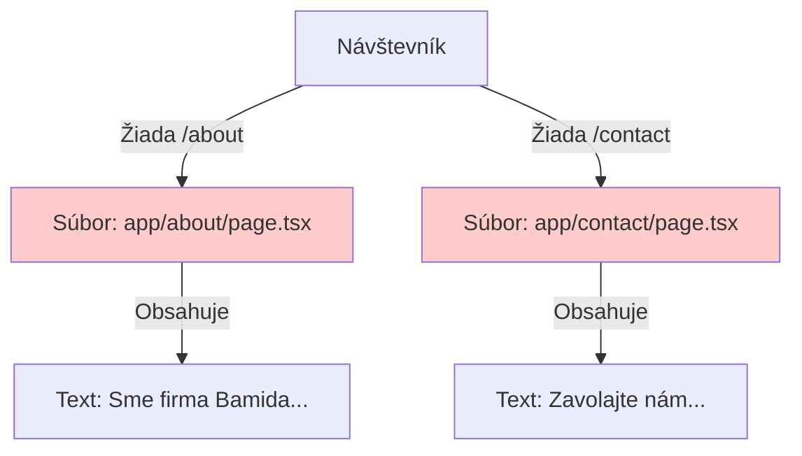
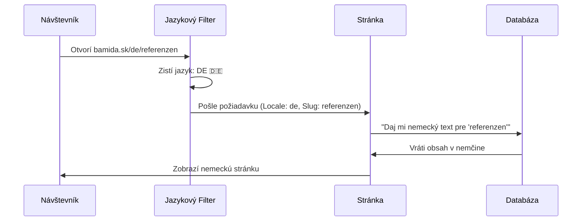

# 🏛️ Ako funguje váš nový web? (Architektúra)

Tento dokument vysvetľuje rozdiel medzi starým a novým systémom a prečo sa veci správajú tak, ako sa správajú.

---

## 1. Starý vs. Nový Prístup

### ❌ Starý Web (Statický Next.js)
Každá stránka mala svoj vlastný súbor. Texty boli napísané priamo v kóde.



**Nevýhoda:** Ak chcete zmeniť text, musíte volať programátora.

---

### ✅ Nový Web (Dynamický Payload CMS)
Máme len **jeden univerzálny súbor** (šablónu), ktorý sa plní obsahom z databázy.

```mermaid
graph TD
    User[Návštevník] -->|Žiada /kontakt| Router[Router: app/[...slug]/page.tsx]
    User -->|Žiada /sluzba/reklama| Router
    
    Router -->|1. Pozrie sa do| DB[(Databáza Payload CMS)]
    DB -->|2. Vráti obsah| Content{Obsah Stránky}
    
    Content -->|3. Vloží do| Template[Šablóna Dizajnu]
    Template -->|4. Zobrazí| User
    
    style Router fill:#ccffcc
    style DB fill:#ccccff
```

**Výhoda:** Texty meníte cez admin panel (Payload), programátora nepotrebujete.

---

## 2. Prečo chýba Blog a Galérie?

Migrovali sme zatiaľ len **Stránky (Pages)**. Vo WordPresse sú rôzne typy obsahu:

| Typ Obsahu | Stav Migrácie | Kde to je? |
| :--- | :--- | :--- |
| **Stránky (Pages)** | ✅ **HOTOVO** | O nás, Kontakt, Služby... (186 URL) |
| **Príspevky (Posts)** | ❌ *Čaká* | Blog, Aktuality, Novinky |
| **Médiá (Media)** | ⚠️ *Čiastočne* | Obrázky v texte sú, ale Galérie chýbajú |
| **Produkty** | ❌ *Čaká* | E-shop produkty |

Preto keď otvoríte stránku "Referencie", vidíte nadpis (lebo to je Stránka), ale nevidíte fotky (lebo to bola Galéria, ktorú sme ešte nepresunuli).

---

## 3. Ako fungujú Jazyky?



---

## 🎯 Zhrnutie

1.  **Dizajn ostal:** Váš web vyzerá rovnako (hlavička, pätička, štýly).
2.  **Motor sa vymenil:** Namiesto statických súborov máme databázu.
3.  **Obsah sa dopĺňa:** Postupne presúvame "nábytok" (Stránky -> Blog -> Galérie).

Teraz sme v stave, kedy máme **Dom** a **Stránky**. Čaká nás presun **Blogu** a **Galérií**.
